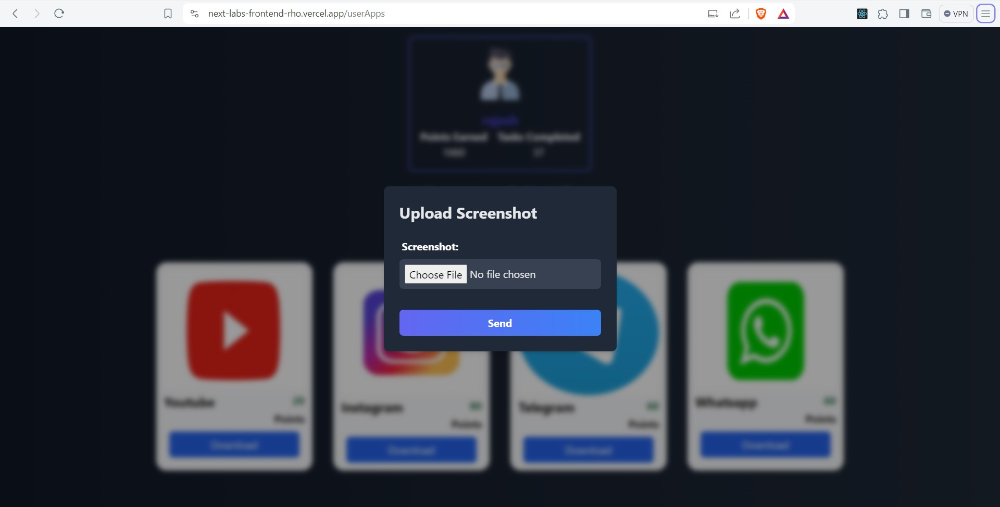
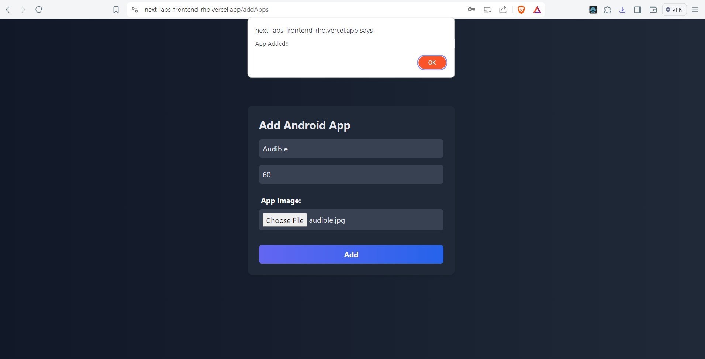

# Next Labs

## Admin Credentials(Only Admin of Site)
  **email-saurabh@gmail.com**

  **password-saurabh1234**

## User Credentials
 ### i)
 ### email- rajesh@gmail.com
 ### password- rajesh1234
 ### ii)
 ### email-rahul@gmail.com
 ### password- rahul1234


# Deployment

Backend Link: https://saurabhss402.pythonanywhere.com/

Deployed Frontend Link: https://next-labs-frontend-rho.vercel.app/

# Run in Local Environment

## Clone Repository
```bash
git clone https://gitlab.com/saurabhs402/nextlab.git
```

## Folders
## Navigate to problemset2 folder in which two folders   FrontendReact and backenddjango
  
### i) cd FrontendReact 
    npm install
    npm start
### To Run the UI

# ii) cd backenddjango

      // Recommended to make virtual env and then install dependencies
      python -m pip install -r requirements.txt
      python manage.py runserver

# Screenshots
- **Home Page**

    
  


                
- **User Login**


- **User Apps**


- **Upload Screenshot**




- **Admin Login**


- **Add App**


- **Audible Added Successfully**    



- **Updated App List**    


- **User Signup**


